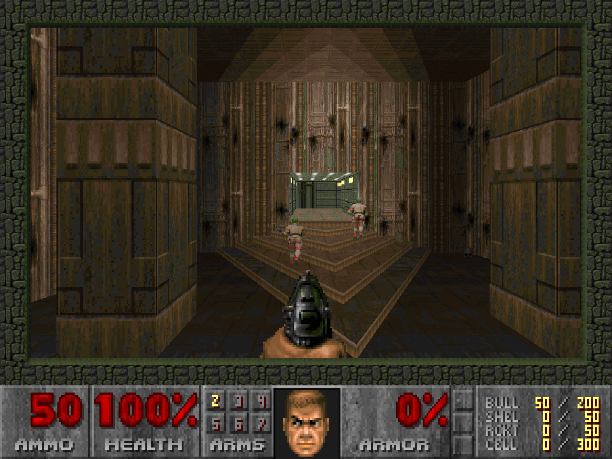

# SDLDoom-SDL3

A modernized fork of **SDLDoom 1.10** — Sam Lantinga's SDL port of id Software's
Linux DOOM (the Jan 10 1997 source drop) — brought up to **SDL 3**, made
**64-bit clean**, and given a **true hi-resolution software renderer** with
in-game Video and Keys menus.

This continues where the long-dormant `sdldoom-1.10-mod` left off.



## What's new vs. the original SDLDoom

- **SDL 1.x → SDL 3.** Window/renderer/streaming-texture display, `SDL_AudioStream`
  audio, `SDL_MAIN_HANDLED` startup. The SDL-specific code stays confined to the
  `i_*` modules.
- **64-bit clean.** Builds and runs as a Win64 binary (MinGW-w64) and natively on
  64-bit Linux. Fixed the classic vanilla-DOOM 32-bit pointer/`int` truncation
  traps (see `CLAUDE.md` for the gory details).
- **True hi-res internal rendering.** The 3D view renders at a real higher
  internal resolution (1×–4× of 320×200), not an upscale. All 2D HUD/menu drawing
  stays authored in 320×200 and is scaled up.
- **In-game Video menu** — resolution, aspect ratio, fullscreen toggle, all
  persisted across runs.
- **In-game Keys menu** — rebind the keyboard controls.
- **Always-Run toggle** — the Run key now toggles persistent run instead of
  needing to be held.
- **Mouse grab** in windowed mode (relative-motion turning; releases on alt-tab).
- **Optional HD / mod assets** — terrain-dependent footstep sounds, a truecolor
  ("fullcolor") 3D view, and HD sprite / wall-texture replacements. Each is an
  opt-in toggle under **Options → Mod**, persisted across runs. The assets are
  built from third-party mod source — see [Optional HD / mod assets](#optional-hd--mod-assets).

## Building

### Windows (MinGW-w64 + SDL3 SDK)

Point `SDL3` at the SDL3 SDK (headers in `$SDL3/include/SDL3`, import lib + DLL in
`$SDL3/lib/<arch>`), then:

```sh
./build.sh        # SDL3=../SDL3 ARCH=x64 by default; produces doom.exe + copies SDL3.dll
```

### Linux (native, SDL3 from the distro)

Install SDL3 development files (e.g. `libsdl3-dev`), then:

```sh
gcc -O2 -o doom *.c $(pkg-config --cflags --libs sdl3) -DSDL_MAIN_HANDLED \
    -Dalloca=__builtin_alloca \
    -Wno-error=implicit-function-declaration -Wno-error=implicit-int \
    -Wno-error=int-conversion -Wno-error=incompatible-pointer-types -lm
```

(The `-Wno-error=` flags relax K&R-isms in the vintage id source that modern gcc
otherwise rejects; `-Dalloca` papers over a glibc/MinGW declaration difference.)

## Running

DOOM needs an **IWAD** (`doom2.wad`, `doom.wad`, `doom1.wad`, …). None ships here —
the game data is commercial and is **not** distributed in this repository. Provide
your own copy:

```sh
./doom -iwad /path/to/doom2.wad
# or set DOOMWADDIR, or drop the WAD next to the binary
```

Useful flags: `-fullscreen`, `-warp <map>`, `-skill N`, `-render N` / `-aspect`,
`-nograbmouse`, `-file <pwad>`. See `CLAUDE.md` and `README.b` for more.

## Optional HD / mod assets

The footstep, fullcolor and HD sprite/texture features are **opt-in** (enable
them under **Options → Mod**). They depend on asset WADs that are **not**
distributed here — they are generated from third-party GZDoom mod packs whose
content is under the mod authors' own terms. Both the source `.pk3`s and the
built `.wad`s are gitignored; the game loads the `.wad`s from the working
directory (i.e. next to `doom.exe`, the `run/` folder).

The generator scripts live in `tools/` and expect the source packs in
`run/`. They require **Python 3**; the footsteps generator additionally needs
**`ffmpeg`** on `PATH` (it transcodes the source audio to DMX format).

| Feature      | Source (see links below)        | Place in `run/` as                | Build with                                  | Produces            |
|--------------|---------------------------------|-----------------------------------|---------------------------------------------|---------------------|
| Footsteps    | zk-resources (DaZombieKiller)   | `footsteps.pk3`                   | `python tools/gen_footsteps.py`   | `run/footsteps.wad` (and regenerates `footstep_tables.h`) |
| HD textures  | DHTP (KuriKai)                  | `zdoom-dhtp-*.pk3` (or `dhtp.pk3`) | `python tools/gen_hdtextures.py`  | `run/hdtextures.wad` |
| HD sprites   | Marcelus HD sprites             | `marcelus_hd_soft.pk3`            | `python tools/gen_hdsprites.py`   | `run/hdsprites.wad`  |

Sources:

- **Footsteps** — [DaZombieKiller/zk-resources](https://github.com/DaZombieKiller/zk-resources).
- **HD textures** — DHTP (DOOM High-resolution Texture Project) by KuriKai et al.:
  project & source at [github.com/KuriKai/DHTP](https://github.com/KuriKai/DHTP/),
  downloads on the [DHTP wiki](https://github.com/KuriKai/dhtp/wiki). The
  generator reads the **GZDoom/ZDoom-format** build — PNGs under
  `filter/doom/hires/` (and `filter/doom.doom2/hires/`). That download is named
  e.g. `zdoom-dhtp-20180514.pk3`; drop it in `run/` as-is (the generator accepts
  any `zdoom-dhtp-*.pk3`, or a plain `dhtp.pk3`). You can also assemble the build
  from the repo with `build/tex-zd.sh`.
- **HD sprites** — Marcelus HD sprites. Download hub (all variants):
  [doomworld.com/forum/topic/130371](https://www.doomworld.com/forum/topic/130371-doom-hd-sprites-and-textures-update-25824/).
  This engine renders in **software mode**, so grab the author's **"HD sprites
  for software mode"** build
  ([Google Drive](https://drive.google.com/file/d/1PUMh-Y6i2QA8dNyE2wuZhy4-50ddqPWo/view))
  and put it in `run/` as `marcelus_hd_soft.pk3`. It carries both the
  first-person weapons and the items/decorations as PNGs under `hires/sprites/`
  with vanilla DOOM frame names (`PISGA0`, `SHTGA0`, `MEDIA0`, …), which the
  engine's name-matching HD path uses directly. The same thread separately links
  the GZDoom (hardware-mode) sprites
  ([ModDB](https://www.moddb.com/games/doom/addons/marcelus-hd-sprites-ver-1-0)),
  an [alternative set](https://www.moddb.com/games/doom/addons/doom-alternative-hd-sprites),
  and [upscaled classic weapons](https://www.moddb.com/games/doom/addons/upscaled-classic-weapons-sprites-for-doom-and-doom-2);
  those hardware/items-only builds work too as long as their PNGs keep the
  vanilla frame names under `hires/sprites/`.

  > Note: GZDoom **ZScript** weapon mods (e.g. Smooth HD Weapons) do **not** work
  > here — their frames use custom names driven by ZScript states / `TEXTURES`,
  > which this engine has no equivalent for. Only name-matching `hires/sprites/`
  > packs apply.

Notes:

- **Footsteps** also regenerates the in-tree `footstep_tables.h` (flat→terrain
  map and per-terrain sound variants) from the pack's `sndinfo.txt` /
  `language.txt`, so rerun it if you update the source pack.
- If your `footsteps.pk3` is instead a "generic terrain" pack laid out as
  `sound/footstep/<terrain>/*.wav` (no `sndinfo.txt`/`language.txt`), use
  `python tools/gen_footsteps_terrainpack.py` instead. It maps that pack's
  terrain folders onto the lump names the committed tables already expect and
  fills any terrain the pack lacks from a close one — so it does **not** touch
  `footstep_tables.h`/`sounds.h`.
- The scripts apply the relevant GZDoom filter precedence (`filter/doom` then
  `filter/doom.doom2`) and only pack DOOM II–relevant, ≤8-char lump names.
- Once the `.wad`s are in `run/`, launch the game and enable each feature in
  **Options → Mod**; the toggles are saved to `.doomrc`.

## License

The engine is id Software's DOOM source under the **DOOM Source Code License**
(`DOOMLIC.TXT`). The SDL port layer follows the original SDLDoom terms
(`README.SDL`). No artwork, levels, or IWADs are included.

See `README.b` for the original Linux DOOM drop notes and what was stripped, and
`CLAUDE.md` for an architecture overview and the porting notes.
